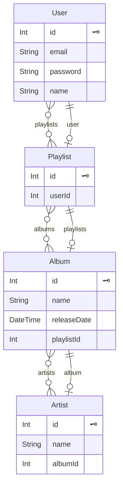

```mermaid
erDiagram

  "User" {
    Int id "🗝️"
    String email 
    String password 
    String name 
    }
  

  "Playlist" {
    Int id "🗝️"
    Int userId 
    }
  

  "Album" {
    Int id "🗝️"
    String name 
    DateTime releaseDate 
    Int playlistId 
    }
  

  "Artist" {
    Int id "🗝️"
    String name 
    Int albumId 
    }
  
    "User" o{--}o "Playlist" : "playlists"
    "Playlist" o|--|| "User" : "user"
    "Playlist" o{--}o "Album" : "albums"
    "Album" o|--|| "Playlist" : "playlists"
    "Album" o{--}o "Artist" : "artists"
    "Artist" o|--|| "Album" : "album"
```
